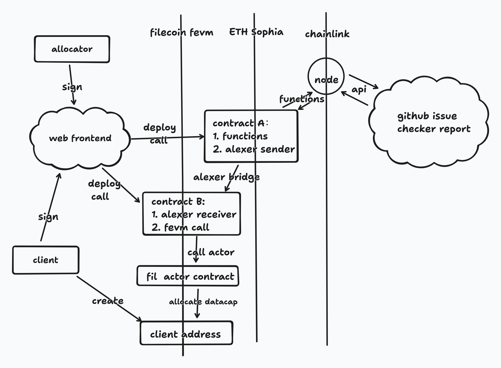

# fil-datacap-scaffold

本项目的目的是辅助 allocator 完成 datacap 的分配。

##### 当前的dc分配逻辑

1. client在issue上提交申请，填写相关信息；
2. allocator根据申请信息做初步审核，包括了：预期节点分布、数据源、数据用途等；
3. 人工审核通过后，client需要完成kyc等认证；
4. 认证通过后，allocator签署分配第一批%5的datacap到对应client地址；
5. client消耗当前80%的dc后，检测机器人提示下一次签单；
6. allocator通过manual check等命令查看报告，里面有数据分布、检索率、重复使用等指标，确认可以继续发放后签单；
7. client继续使用，如此循环直至本次申请额度发放完毕；

##### 目标

辅助的首要目标是：通过智能合约将allocator的签单自动化。
allocator仍然可以手动签单，但是通过合约的方式更能减少人工错误，表明了allocator严格遵守分配制度的决心。

allocator的签单主要分为两类，它们有不同的审核标准：
- 首次签单：
    - 人工审核提交的资料 
    - kyc认证 
- 续签单：
    - dc 消耗达到 80%
    - 检索报告指标达标

##### 如何自动化

- 人工审核提交的资料： 这一步只能是人工审核，但是通过后，可以调用智能合约申请一个预案。
  - 资料中的节点号也可以提交到链上，可供后续封装报告比对是否一致
- kyc认证：参照 fidlabs 的做法，可以使用 去中心化kyc 认证，认证后可将结果提交到链上，client可以调用合约的预案去检查，通过后合约调用fevm自动发放首批数据
  - 当前的主流去中心化kyc都是eth兼容链上的，因此可能要做跨链获取数据
- dc消耗达到80%：目前都是有单独的bot做这个检查，理想的方式是通过fevm能获取到这个数据
- 检索报告指标达标：检索是一种链下的行为，官方的报告目前也是中心化的，可在issue中查看，因此需要使用预言机来获取数据

##### Roadmap

- [ ] 检索报告指标达标自动化分发dc

##### 总体设计

##### 面临的复杂性

- fevm的社区生态较为薄弱，比如chainlink预言机还不支持fil
- fevm的内置actor功能还不够完善，能否支持想要的功能
- 未考虑到的设计，如果官方检索报告提供了api，甚至api可直接返回通过/未通过，那么就方便多了，但现实的情况是要去做解析
- 以上这些都会增加后续维护的难度

##### 参考

- chainlink functions  -- 去中心化预言机   [官方文档](https://docs.chain.link/chainlink-functions)  [使用示例](https://usechainlinkfunctions.com/)
  - 可以在合约中编写js代码调用api获取相关数据达成预言机功能，灵活性较高
  - 依托chainlink链本身的多个节点去调用api并整合，防止单个节点的欺诈行为
  - chainlink functions 目前还不支持fevm
- axelar --   跨链桥    [官方文档](https://docs.axelar.dev/)  [使用示例](https://github.com/axelarnetwork/foundry-axelar-gmp-example)
  - axelar 是 [fil官方文档推荐的跨链桥](https://docs.filecoin.io/smart-contracts/advanced/cross-chain-bridges) 
- [contract-metaallocator](https://github.com/fidlabs/contract-metaallocator) - fidlabs维护的一个根据datacap分配合约库，可做参考
- foundry -- 合约开发首选
- [scaffold-eth-2](https://github.com/scaffold-eth/scaffold-eth-2) -- 集成了react前端和合约开发工具hardhat/foundry的开发脚手架
- [gitcoin passport](https://app.passport.xyz/#/) -- 去中心化的一个kyc项目，fidlabs 使用了